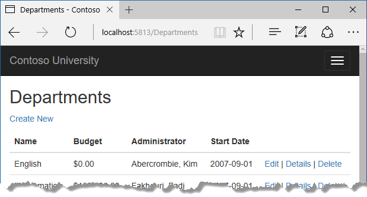
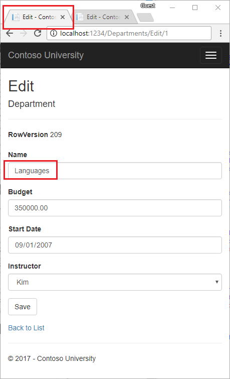
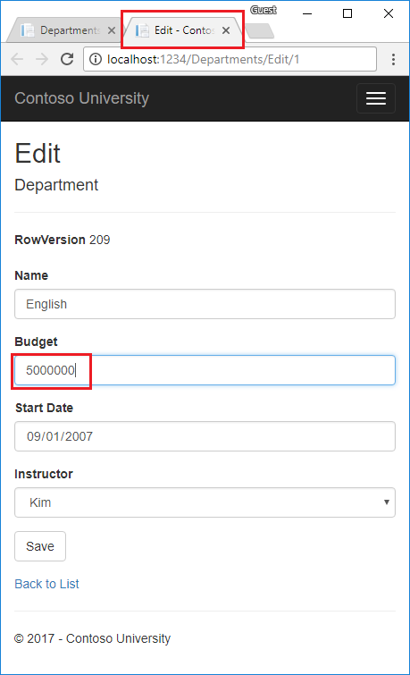
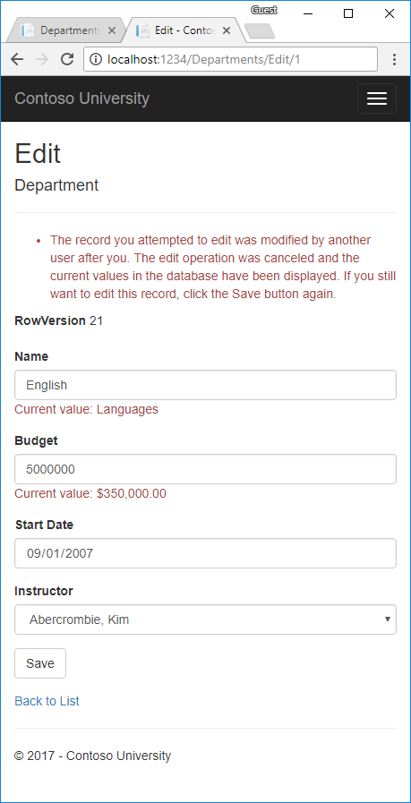
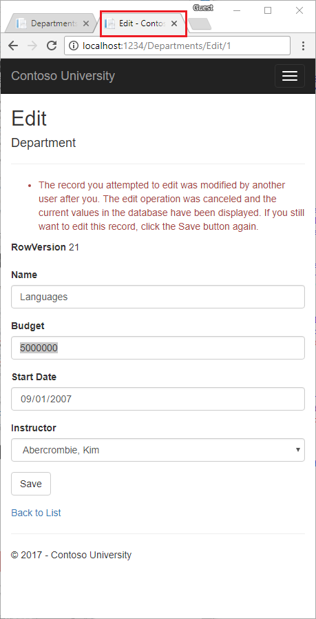

en-us/
?view=netcore-2.0

# Handling concurrency conflicts - EF Core with Razor Pages (8 of 8)

By [Rick Anderson](https://twitter.com/RickAndMSFT) and [Tom Dykstra](https://github.com/tdykstra)

[!INCLUDE[about the series](../../includes/RP-EF/intro.md)]

This tutorial shows how to handle conflicts when multiple users update an entity concurrently (at the same time). If you run into problems you can't solve, download the [completed app for this stage](https://github.com/aspnet/Docs/tree/master/aspnetcore/data/ef-rp/intro/samples/StageSnapShots/cu-part8).

## Concurrency conflicts

A concurrency conflict occurs when:

* A user navigates to the edit page for an entity.
* Another user updates the same entity before the first user's change is written to the DB. 

If concurrency detection is not enabled, when concurrent updates occur:

* The last update wins. That is, the last update values are saved to the DB.
* The first of the current updates are lost. That's generally not what you want.

### Pessimistic concurrency (locking)

DB locking, also called pessimistic concurrency, is a concurrency approach. For example, before a row is read from the db, the app can request a lock for read-only or for update access. If a row is locked for update access:

* Other users can't lock the row for read-only access. That is, other users can't read the data.
* Other users can't lock the row for update access. 

If a row is locked for read-only access:

* Other users can also read the data. That is, they can lock it for read-only access.
* Other users cannot get an update lock to update the data.

Managing locks has disadvantages:

* It's complex to program. 
* It requires significant DB management resources.
* It can cause performance problems as the number of users of an app increases. 

Not all DB management systems support pessimistic concurrency. EF Core provides no built-in support for pessimistic locking. This tutorial doesn't show how to implement pessimistic concurrency.

### Optimistic concurrency

Optimistic concurrency allows concurrency conflicts to happen, and then reacts appropriately when they do. For example, Jane visits the Department edit page and changes the budget for the English department from $350,000.00 to $0.00.


Before Jane clicks **Save**, John visits the same page and changes the Start Date field from 9/1/2007 to 9/1/2013.


Jane clicks **Save** first and sees her change when the browser displays the Index page.



John clicks **Save** on an Edit page that still shows a budget of $350,000.00. What happens next is determined by how you handle concurrency conflicts.

Optimistic concurrency includes the following options:

* You can keep track of which property a user has modified and update only the corresponding columns in the DB.

     In the scenario, no data would be lost. Different properties were updated by the two users. The next time someone browses the English department, they'll see both Jane's and John's changes. This method of updating can reduce the number of conflicts that could result in data loss. This approach:
		* Can't avoid data loss if competing changes are made to the same property. 
		* Is generally not practical in a web app.  It requires maintaining significant state in order to keep track of all fetched values and new values. Maintaining large amounts of state can affect app performance.
		* Can increase app complexity compared to concurrency detection on an entity.

* You can let John's change overwrite Jane's change.

     The next time someone browses the English department, they'll see 9/1/2013 and the fetched $350,000.00 value. This approach is called a *Client Wins* or *Last in Wins* scenario. (All values from the client take precedence over what's in the data store.) If you don't do any coding for concurrency handling, this happens automatically.

* You can prevent John's change from being updated in the DB.Typically, the app would:
		* Display an error message.
		* Show the current state of the data.
		* Allow the user to reapply the changes. 
		
 This is called a *Store Wins* scenario. (The data-store values take precedence over the values submitted by the client.) You implement the Store Wins scenario in this tutorial. This method ensures that no changes are overwritten without a user being alerted to what's happening.

### Detecting concurrency conflicts

Concurrency conflicts can be handled by catching [DbUpdateConcurrencyException](https://docs.microsoft.com/en-us/dotnet/api/microsoft.entityframeworkcore.dbupdateconcurrencyexception?view=efcore-2.0). The DB and data model must be configured to support throwing `DbUpdateConcurrencyException`. 

To detect concurrency conflicts, add a [rowversion](https://docs.microsoft.com/en-us/sql/t-sql/data-types/rowversion-transact-sql) tracking column in the DB table. `rowversion` is used to determine that a enity has not been changed since it was fetched from the DB. The DB generates a sequential `rowversion` number that's incremented each time the row is updated. In an `Update` or `Delete` command, the `Where` clause includes the fetched value of `rowversion`. If the row being updated has changed:

 * `rowversion` doesn't match the fetched value.
 * The `Update` or `Delete` commands don't find a row because the `Where` clause includes the fetched `rowversion`.
 * A `DbUpdateConcurrencyException` is thrown.

In EF, when no rows have been updated by an `Update` or `Delete` command, a concurrency exception is thrown.

## Add a tracking property to the Department entity

In *Models/Department.cs*, add a tracking property named RowVersion:

[!code-csharp[Main](intro/samples/cu/Models/Department.cs?name=snippet_Final&highlight=26,27)]

The [Timestamp](https://docs.microsoft.com/en-us/dotnet/api/system.componentmodel.dataannotations.timestampattribute?view=netcore-2.0) attribute specifies that this column is included in the `Where` clause of `Update` and `Delete` commands. The attribute is called `Timestamp` because previous versions of SQL Server used a SQL `timestamp` data type before the SQL `rowversion` type replaced it.

The fluent API can also specify the tracking property:

```csharp
modelBuilder.Entity<Department>()
    .Property(p => p.RowVersion).IsConcurrencyToken();
```

Adding the `RowVersion` property changes the DB model, which requires a migration.

Build the project. Enter the following in a command window:

```console
dotnet ef migrations add RowVersion
dotnet ef database update
```

The preceding commands:

* Adds the *Migrations/{time stamp}_RowVersion.cs* migration file.
* Updates the *Migrations/SchoolContextModelSnapshot.cs* file. The update adds the following highlighted code to the `BuildModel` method:

[!code-csharp[Main](intro/samples/cu/Migrations/SchoolContextModelSnapshot2.cs?name=snippet&highlight=14-16)]
	
* Runs migrations to update the DB.

<a name="scaffold"></a>
## Scaffold the Departments model

* Exit Visual Studio.
* Open a command window in the project directory (The directory that contains the *Program.cs*, *Startup.cs*, and *.csproj* files).
* Run the following command:

 ```console
dotnet aspnet-codegenerator razorpage -m Department -dc SchoolContext -udl -outDir Pages\Departments --referenceScriptLibraries
 ```

The preceding command scaffolds the `Department` model. Open the project in Visual Studio.

Build the project. The build generates errors like the following:

`1>Pages/Departments/Index.cshtml.cs(26,37,26,43): error CS1061: 'SchoolContext' does not
 contain a definition for 'Department' and no extension method 'Department' accepting a first
 argument of type 'SchoolContext' could be found (are you missing a using directive or
 an assembly reference?)`

 Globally change `_context.Department` to `_context.Departments` (that is, add an "s" to `Department`). 7 occurrences are found and updated.
 
 <!--
In the *DepartmentsController.cs* file, change all four occurrences of "FirstMidName" to "FullName" so that the department administrator drop-down lists will contain the full name of the instructor rather than just the last name.
 
[!code-csharp[Main](intro/samples/cu/Controllers/DepartmentsController.cs?name=snippet_Dropdown)]
-->


### Update the Departments Index page

The scaffolding engine created a `RowVersion` column for the Index page, but that field shouldn't be displayed. In this tutorial, the last byte of the `RowVersion` is displayed to help understand concurrency. The last byte is not guaranteed to be unique. A real app wouldn't display `RowVersion` or the last byte of `RowVersion`.

Update the Index page:

* Replace Index with Departments.
* Replace the markup containing `RowVersion` with the last byte of `RowVersion`.
* Replace FirstMidName with FullName.

The following markup shows the updated page:

[!code-cshtml[](intro/samples/cu/Pages/Departments/Index.cshtml?highlight=5,8,29,47,50)]

### Update the Edit page model

Update *pages\departments\edit.cshtml.cs* with the following code:

[!code-csharp[](intro/samples/cu/Pages/Departments/Edit.cshtml.cs?name=snippet)]

To detect a concurrency issue, the [OriginalValue](https://docs.microsoft.com/en-us/dotnet/api/microsoft.entityframeworkcore.changetracking.propertyentry.originalvalue?view=efcore-2.0#Microsoft_EntityFrameworkCore_ChangeTracking_PropertyEntry_OriginalValue) is updated with the `rowVersion` value from the entity was it was fetched. EF generates a SQL UPDATE command with a WHERE clause containing the original `RowVersion` value. If no rows are affected by the UPDATE command (no rows have the original `RowVersion` value), a `DbUpdateConcurrencyException` exception is thrown. 

[!code-csharp[](intro/samples/cu/Pages/Departments/Edit.cshtml.cs?name=snippet_rv&highlight=24-)]

In the preceding code, `Department.RowVersion` is the value when the entity was fetched. `OriginalValue` is the value in the DB when `FirstOrDefaultAsync` was called in this method.

The following code gets the client values (the values posted to this method) and the DB values:

[!code-csharp[](intro/samples/cu/Pages/Departments/Edit.cshtml.cs?name=snippet_try&highlight=9,18)]

The follwing code adds a custom error message for each column that has DB values different from what was posted to `OnPostAsync`:

[!code-csharp[](intro/samples/cu/Pages/Departments/Edit.cshtml.cs?name=snippet_err)]

The following highlighted code sets the `RowVersion` value to the new value retrieved from the DB. The next time the user clicks **Save**, only concurrency errors that happen since the last display of the Edit page will be caught.

[!code-csharp[](intro/samples/cu/Pages/Departments/Edit.cshtml.cs?name=snippet_try&highlight=23)]

The `ModelState.Remove` statement is required because `ModelState` has the old `RowVersion` value. In the Razor Page, the `ModelState` value for a field takes precedence over the model property values when both are present.

## Update the Edit page

Update *Pages/Departments/Edit.cshtml* with the following markup:

[!code-cshtml[](intro/samples/cu/Pages/Departments/Edit.cshtml?highlight=1,14,16-17,37-39)]

The preceding markup:

* Updates the `page` directive from `@page` to `@page "{id:int}"`.
* Adds a hidden row version. `RowVersion` must be added so post back binds the value.
* Displays the last byte of `RowVersion` for debugging purposes.
* Replaces `ViewData` with the strongly-typed `InstructorNameSL`.

## Test concurrency conflicts with the Edit page

Open two browsers instances of Edit on the English department:

* Run the app and select Departments. 
* Right-click the **Edit** hyperlink for the English department and select **Open in new tab**.
* In the first tab, click the **Edit** hyperlink for the English department. 

The two browser tabs display the same information.

Change the name in the first browser tab and click **Save**.



The browser shows the Index page with the changed value and updated rowVersion indicator. Note the updated rowVersion indicator, it is displayed on the second postback in the other tab.

Change a different field in the second browser tab.



Click **Save**. You see error messages for all fields that don't match the DB values:



This browser window did not intend to change the Name field. Copy and paste the current value (Languages) into the Name field. Tab out. Client-side validation removes the error message.



Click **Save** again. The value you entered in the second browser tab is saved. You see the saved values in the Index page.

## Update the Delete page

Update the Delete page model with the following code:

[!code-csharp[](intro/samples/cu/Pages/Departments/Delete.cshtml.cs)]

The Delete page detects concurrency conflicts when the entity has changed after it was fetched. `Department.RowVersion` is the row version when the entity was fetched.  When EF creates the SQL DELETE command, it includes a WHERE clause with `RowVersion`. If the SQL DELETE command results in zero rows affected:

* The `RowVersion` in the SQL DELETE command doesn't match `RowVersion` in the DB.
* A DbUpdateConcurrencyException exception is thrown.
* `OnGetAsync` is called with the `concurrencyError`.

### Update the Delete page

Update *Pages/Departments/Delete.cshtml* with the following code:

[!code-cshtml[](intro/samples/cu/Pages/Departments/Delete.cshtml?highlight=1,10,36,51)]


The preceding markup makes the following changes:

* Updates the `page` directive from `@page` to `@page "{id:int}"`.
* Adds an error message.
* Replaces FirstMidName with FullName in the **Administrator** field.
* Changes `RowVersion` to display the last byte.
* Adds a hidden row version. `RowVersion` must be added so post back binds the value.

### Test concurrency conflicts with the Delete page

Create a test department.

Open two browsers instances of Delete on the test department:

* Run the app and select Departments. 
* Right-click the **Delete** hyperlink for the test department and select **Open in new tab**.
* Click the **Edit** hyperlink for the test department. 

The two browser tabs display the same information.

Change the budget in the first browser tab and click **Save**.

The browser shows the Index page with the changed value and updated rowVersion indicator. Note the updated rowVersion indicator, it is displayed on the second postback in the other tab.

Delete the test department from the second tab. A concurrency error is display with the current values from the DB. Clicking **Delete** deletes the entity, unless `RowVersion` has been updated.department has been deleted.

See [Inheritance](xref:data/ef-mvc/inheritance) for instruction on how to inheritance in the data model. 

>[!div class="step-by-step"]
[Previous](xref:data/ef-mvc/update-related-data)
